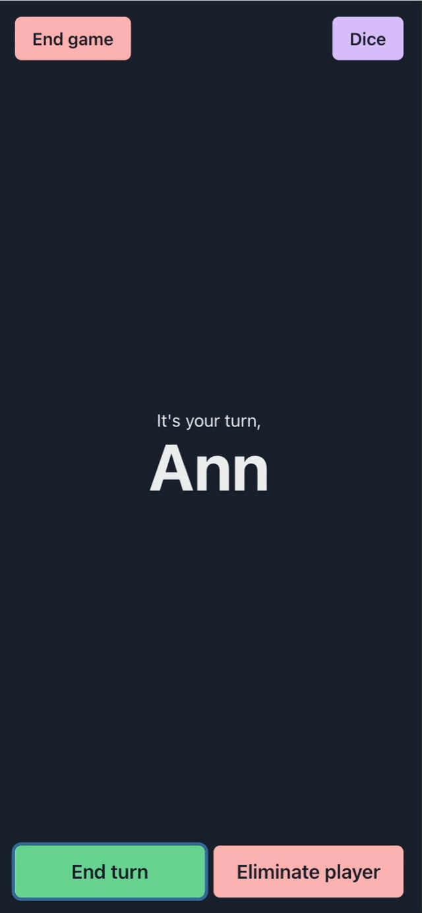

# Turn Taker
This React application is built to help keep track of which player takes turn in complicated table top or role playing games. It has been designed with mobile-first in mind so it can easily be used on a mobile phone while playing games.

## Local setup
You can set up this application locally by following these steps. Please note that you need to have `node` and `npm` installed on your local machine before you start.

1. Clone this repository.
2. Navigate to the root of the project and run `npm install`.
3. Run `npm run dev`.
4. Open up your browser and go to `http://localhost:5173/`.

## Screenshots

### Adding a player and starting game

### Using the built-in dice simulator

